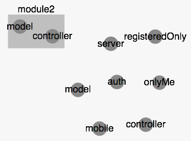
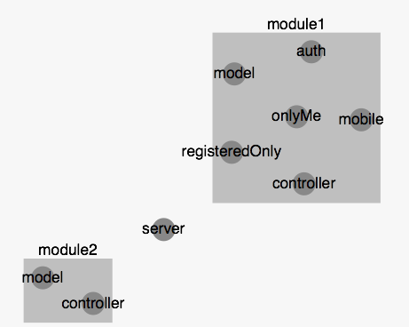
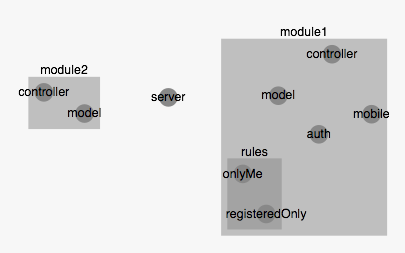
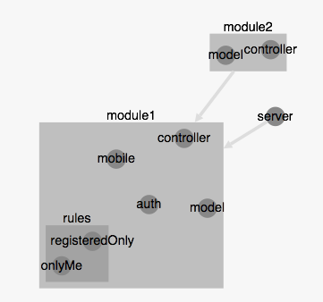
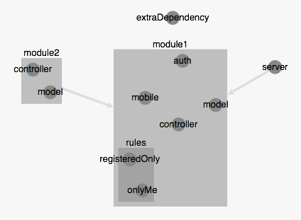
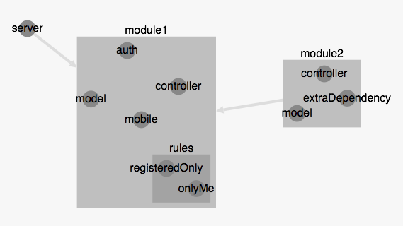
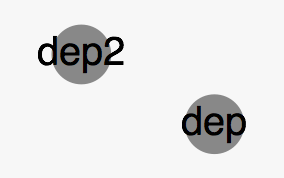

Defining containers/modules
-------------

> **Principles:**

> - Rely on directory structure
> - Each module is isolated from other modules
> - Allow injection of dependencies from the containing module
> - Module are requirable components


The modules organisation is defined with the last argument of `appjector.container`. you can find informations for this method [here](http://machard.github.io/appjector/appjector.html)

---------------------

Considering the given file tree

```
├── app
│   ├── module1
│   │   ├── controller.js
│   │   ├── middlewares
│   │   │   ├── auth.js
│   │   │   ├── mobile.js
│   │   │   └── rules
│   │   │       ├── onlyMe.js
│   │   │       └── registeredOnly.js
│   │   └── model.js
│   ├── module2
│   │   ├── controller.js
│   │   └── model.js
│   └── server.js
├── index.js

```

------------------------

<table>
  <tr>
    <td><b>Bootstraping</b></td>
    <td><b>Resulting Map</b></td>
  </tr>
  <tr>
    <td>
    If no modules are defined with this file tree, there will be multiple components with the name <code>controller</code> and <code>model</code> at the same level
     <pre lang="javascript">
appjector.container('./app').run();
     </pre>
    </td>
    <td><pre>          invalide                          </pre></td>
  </tr>
  <tr>
    <td>
    Define a module based on his relative path
    <br /><br />
    Modules allows isolated components spaces
     <pre lang="javascript">
appjector.container('./app', {
  'module2' : {}
}).run();
     </pre>
    </td>
    <td></td>
  </tr>
  <tr>
    <td>
    Or multiple modules
     <pre lang="javascript">
appjector.container('./app', {
  'module1' : {},
  'module2' : {}
}).run();
     </pre>
    </td>
    <td></td>
  </tr>
  <tr>
    <td>
    Define nested modules if needed. the name will be taken from the deepest path
     <pre lang="javascript">
appjector.container('./app', {
  'module1' : {
  	modules : {
  	  'middlewares/rules' : {}
  	}
  },
  'module2' : {}
}).run();
     </pre>
    </td>
    <td></td>
  </tr>,
  <tr>
    <td>
    require server and module2 to be available for injection inside module1 components
     <pre lang="javascript">
appjector.container('./app', {
  'module1' : {
    // specify component of 
    require : ['server', 'module2'],
  	modules : {
  	  'middlewares/rules' : {}
  	}
  },
  'module2' : {}
}).run();
     </pre>
     For example
     <pre lang="javascript">
    //app/module1/controller.js
    
    module.exports = function(auth, server, module2) {
    	//server is accessible
    	server;
    	//every deps of module2 :
    	module2.get('controller');
    	
    	return ...;
    }
    </pre>
    </td>
    <td></td>
  </tr>
  <tr>
    <td>
    extra dependencies can be specified at the app level
     <pre lang="javascript">
appjector.container({
  extraDependency : function(module2, server) { return ... }
}, './app', {
  'module1' : {
    // specify component of 
    require : ['server', 'module2'],
  	modules : {
  	  'middlewares/rules' : {}
  	}
  },
  'module2' : {}
}).run();
     </pre>
     Extra dependency can have dependencies. This allows to reuse a dependency between apps for example.
    </td>
    <td></td>
  </tr>
  <tr>
    <td>
    or at a module level
     <pre lang="javascript">
appjector.container('./app', {
  'module1' : {
    // specify component of 
    require : ['server', 'module2'],
  	modules : {
  	  'middlewares/rules' : {}
  	}
  },
  'module2' : {
  	dependencies : {
  	  extraDependency : function(model) { return ... }
  	}
  }
}).run();
     </pre>
    </td>
    <td></td>
  </tr>
  <tr>
    <td>
    or just dependencies. in this case modules definition can not be used as no app path is specified.
     <pre lang="javascript">
appjector.container({
  dep : {},
  dep2 : {}
}).run();
     </pre>
    </td>
    <td></td>
  </tr>
</table>
