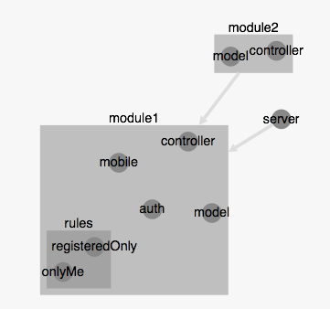

Tests
-------------

> **Principles:**

> - Each container can isolate it's component
> - Possible to replace/remove components
> - Possible to keep a sub container

you can find informations for these methods [here](http://machard.github.io/appjector/Container.html).

-------------------------

Given this organization

-------------------------

Isolate a component
-------------

We want to isolate the `module1` `controller` who has `model` and `server` as dependencies

<pre lang="javascript">
var isolatedController = appContainer
  .isolate(['module1', 'controller'], {
	server : serverMock,
	model : modelMock
  });
</pre>

Remove some submodule/component
-------------

We want to have an app without `onlyMe` in `rules` and with only `server` and `module1`.

<pre lang="javascript">
var newApp = appContainer
  .keep(['module1', 'server']); // sugar syntax for .keep([], ['module1', 'server'])
  .without(['module1', 'rules'], ['onlyMe']);
</pre>
or
<pre lang="javascript">
var newApp = appContainer
  .without(['module2']); // sugar syntax for .without([], ['module2'])
  .keep(['module1', 'rules'], ['registeredOnly']);
</pre>

Replace a component
-------------

We want to replace `auth` by a mock.

<pre lang="javascript">
var appContainer = appContainer
  .replace(['module1', 'auth'], authMock);
</pre>

Mock node modules
-------------
For the moment it consists to define them explicitely as dependencies so they can be mocked using previous methods.

<pre lang="javascript">
var appContainer = appjector.container('./app', {
	module1 : {
		dependencies : {
		    gcm : require('node-gcm')
		}
	}
});
</pre>

Conclusion
-------------
With all of these method + the use of appswitch it allows to create/isolate a specific container/components, start it, test it, and then stop it.
If done correctly, each time it starts it's fresh.